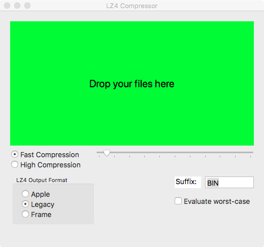

LZ4CompressorX is a Mac OS X application build on top of Yann Collet's LZ4Library version 1.7.1. It is written in Objective-C with a deployment target of macOS 10.5. The files of the LZ4 library are imported directly into the project. 

When launched, the application displays a single window.
 
 
 

 
 
 

The application can accept an input of multiple files via

a) a drag-and-drop onto the indicated area of the window, 
b) a double-click, and, 
c) a contextual menu.

The program can identify if a file has been compressed with LZ4 algorithm. Uncompressed files will be deflated while LZ4 compressed files will be inflated.

It is recommended LZ4 compressed files to be named with a file extension LZ4 e.g. source.LZ4 if the user intends to open these with a double-click or by bringing up the contextual menu (control-click). The suffix is not necessary if the files are opened via a drag-and-drop.

This program applies the LZ4 block compression algorithm during compression. Three output compression formats are supported; a brief description is given below.
 

  i) Legacy format: 16-byte header followed by LZ4 compressed data,  
 ii) Apple format: 12-byte header and 4-byte trailer with LZ4 compressed data in between the two, 
iii) Frame: header of 7-15 bytes followed by multiple blocks of compressed data ending with a checksum. 

Please refer to documentation listed at the various websites using the web links below.

Since this application runs on Mac OS X 10.5 or later, it does not call LZ4 compression methods developed by Apple which were introduced in macOS 10.11. Instead, the data is compressed using the functions of the standard LZ4 library with the output file written in a layout that conforms to Apple's specifications.

Please note: this application cannot read LZ4 compressed files that are encoded by Apple's LZ4 compression stream methods. It should not have problems reading those that were encoded by Apple's LZ4 compression block methods.

 
 
 

**System Requirements:** 
Hardware: A Macintosh computer 
Software: Mac OS X 10.5.x or later
 
 

**References:**

https://github.com/lz4/lz4/blob/master/doc/lz4_Frame_format.md

https://developer.apple.com/documentation/compression/compression_lz4

https://www.brutaldeluxe.fr/products/crossdevtools/lz4/index.html
